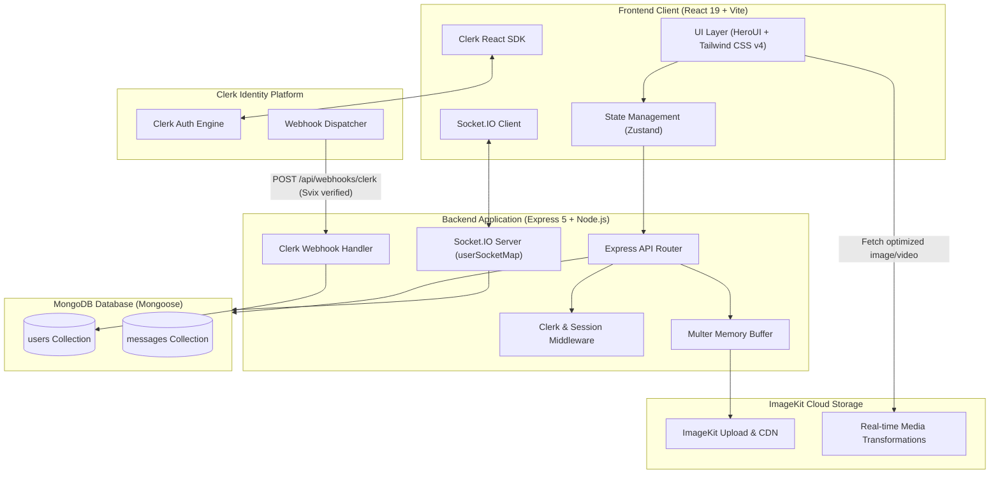
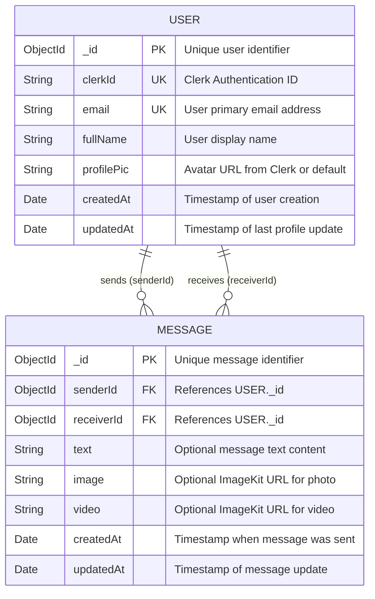
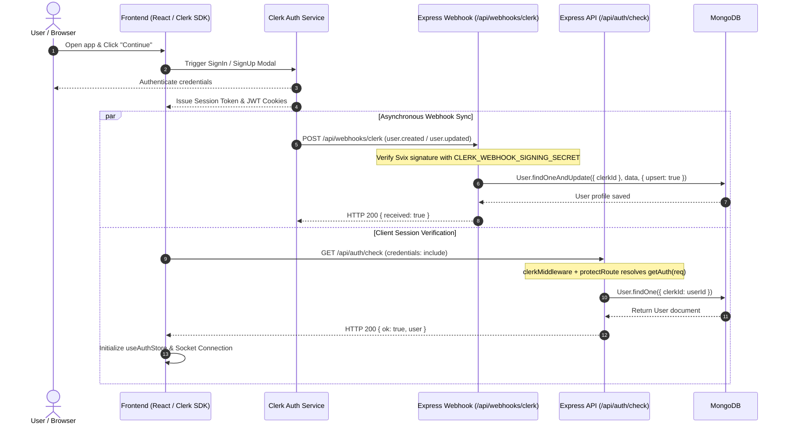
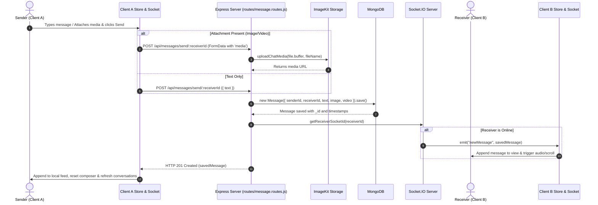
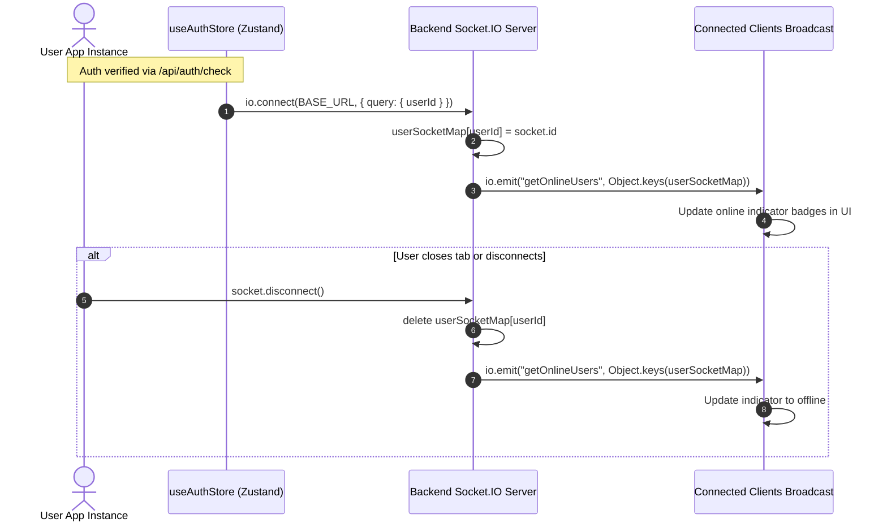
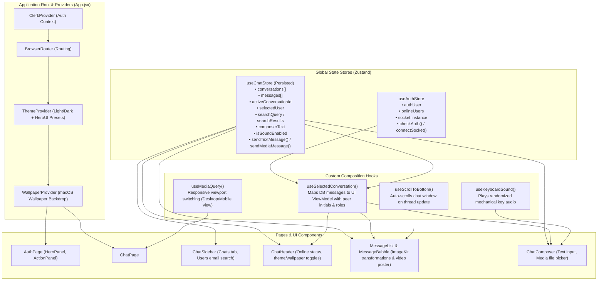

# System Architecture & Technical Design

## 1. High-Level System Architecture

The application is structured as a full-stack real-time communication platform combining RESTful APIs for data persistence and media processing with WebSockets (Socket.IO) for bi-directional live messaging and user presence.

---

## 2. Entity-Relationship (ER) Diagram

The persistence layer uses MongoDB via Mongoose. The database is organized around two primary collections: `User` and `Message`.

---

## 3. Data Flow & Sequence Diagrams

### 3.1 Authentication & User Profile Synchronization

User accounts are authenticated through Clerk. When users sign up or update profiles, Clerk emits a signed webhook that syncs the user into MongoDB, making them immediately available in search and chat.

---

### 3.2 Real-Time Messaging & Media Delivery

When a user sends a message (text, image, or video), the message is processed via REST API and dispatched in real time via Socket.IO to the recipient.

---

### 3.3 User Presence & Socket Lifecycle

Presence tracking is maintained entirely in-memory on the Socket.IO server via `userSocketMap`.

---

## 4. Frontend State Management & Context Pipeline

The frontend separates concerns into modular Zustand stores for business logic and React Contexts for UI personalization:

---

