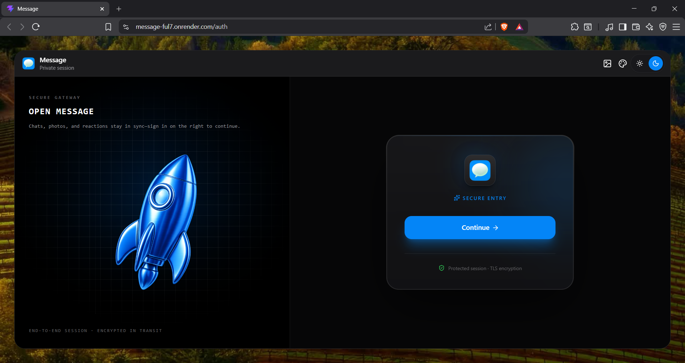
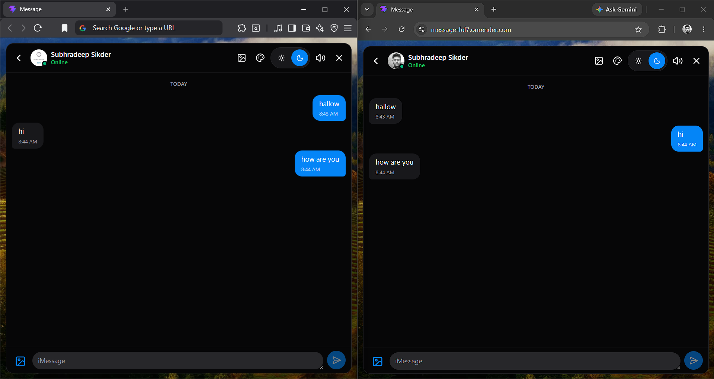

# Message

This is a web application that looks and works like chat application. It allows users to login, search for other users by email, and chat with them in real time. It also supports sending images and videos.

## 1. About the Project and Its Value

This is a simple web chat application. It lets users log in, find other users by email, and chat in real time with text, images, and videos.

Many modern chat apps are too complicated for normal users. This project solves that by offering a very simple and familiar interface that requires zero training. It helps small teams or local businesses talk to each other or to customers quickly and easily.

## 2. User Guide

1. **Sign In**: Open the app and click "Continue" to sign in or create an account.
2. **Find a Chat**: Go to the "Users" tab, type a user's email in the search bar, and click on their name.
3. **Send Messages**: Type in the box at the bottom and click send. You can send text, pictures, or videos.
4. **Customize**: Click the icons in the top bar to change the background, accent colors, or sound settings.

## 3. Tech Stack

* Frontend: React, Tailwind CSS, HeroUI, Zustand
* Backend: Node.js, Express, Socket.io
* Database: MongoDB
* Authentication: Clerk
* Media Storage: ImageKit

## 4. UI Overview


### Sign In Page


### Chat Window


## 5. How to Set Up Locally

Prerequisites: Node.js, MongoDB, ImageKit, Clerk

### Step 1: Clone the repository
Clone the project folder to your local machine:
```bash
git clone https://github.com/Subhradeep-Sikder/message.git
cd message
```

### Step 2: Set up the Backend
1. Go to the backend directory:
   ```bash
   cd backend
   ```
2. Install the backend dependencies:
   ```bash
   npm install
   ```
3. Create a file named `.env` in the backend folder and fill in these keys:
   ```env
   PORT=3000
   MONGO_URI=your_mongodb_connection_string
   CLERK_PUBLISHABLE_KEY=your_clerk_publishable_key
   CLERK_SECRET_KEY=your_clerk_secret_key
   CLERK_WEBHOOK_SIGNING_SECRET=your_clerk_webhook_signing_secret
   IMAGEKIT_PRIVATE_KEY=your_imagekit_private_key
   FRONTEND_URL=http://localhost:5173
   ```
   To get these keys:
   *  [MongoDB Atlas](https://www.mongodb.com/cloud/atlas)
   * [Clerk Dashboard](https://clerk.com)
   *  [ImageKit Developer Console](https://imagekit.io)
4. Start the backend development server:
   ```bash
   npm run dev
   ```

### Step 3: Set up the Frontend
1. Open a new terminal window and navigate to the frontend directory:
   ```bash
   cd frontend
   ```
2. Install the frontend dependencies:
   ```bash
   npm install
   ```
3. Create a file named `.env` in the frontend folder and add your Clerk publishable key:
   ```env
   VITE_CLERK_PUBLISHABLE_KEY=your_clerk_publishable_key
   ```
    [Clerk Dashboard](https://clerk.com)
4. Start the frontend development server:
   ```bash
   npm run dev
   ```

Now open `http://localhost:5173` in your browser to view and use the app.

## 6. Planned Future Improvements

* Add a search bar to search for text inside messages.
* Add read receipts to show when a message has been read.
* Add voice messaging.
* Add group chats.

## 7. Author

Built by [Subhradeep Sikder](https://github.com/Subhradeep-Sikder).
